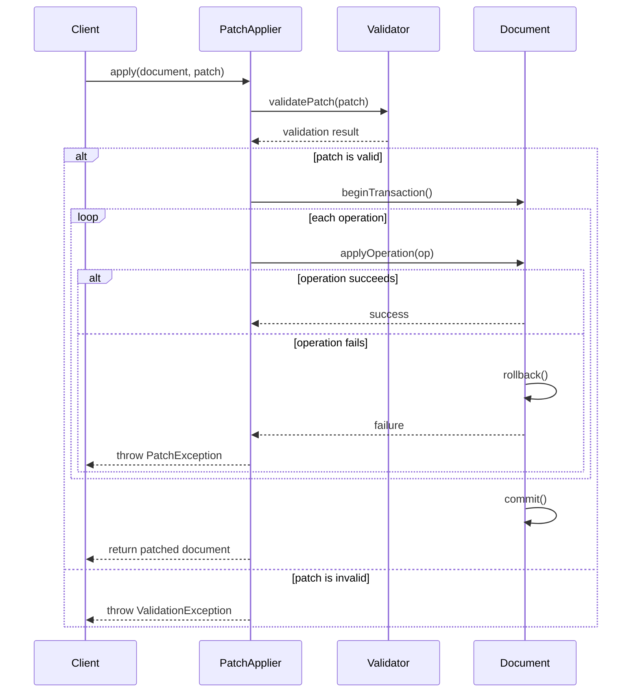
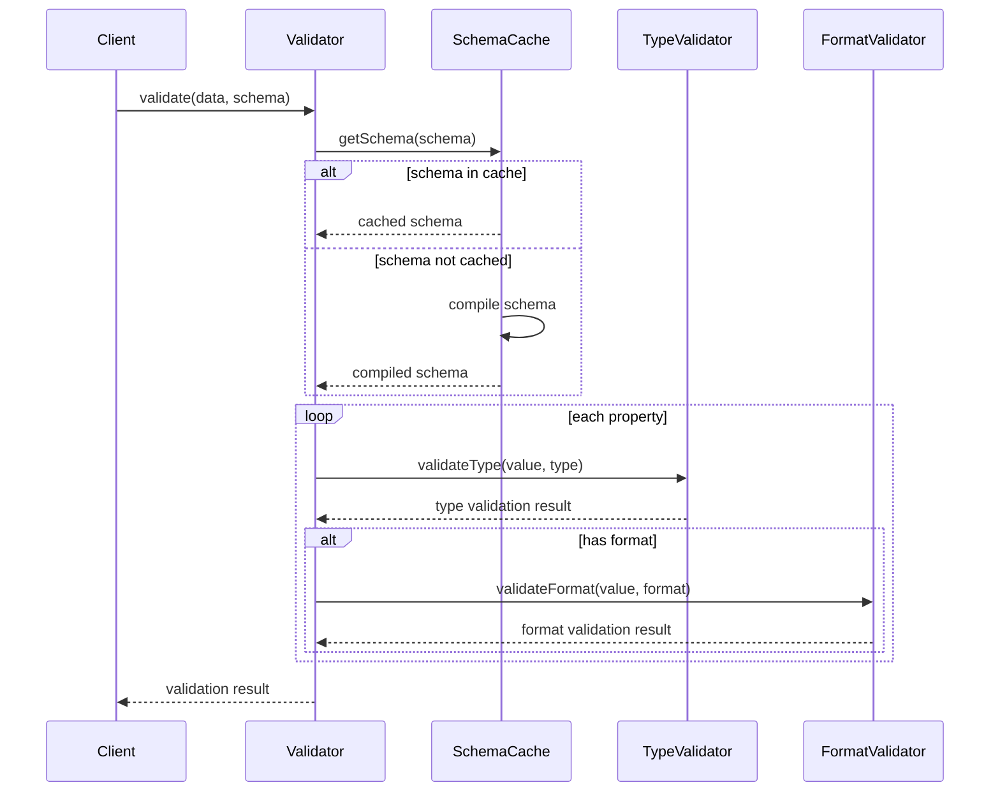

# JSON Parser Library Features

## Core Components

### 1. JSON Serialization and Parsing
**Location**: `src/Json/Serializer.php`
- Type-safe JSON encoding and decoding
- Strict error handling for malformed JSON
- Support for associative arrays and objects
- Custom encoding/decoding options
- JSON5 support with comment preservation

### 2. JSON Schema Validation
**Location**: `src/Schema/Validator.php`
- Full JSON Schema Draft 2020-12 support
- Type validation (string, number, integer, boolean, array, object, null)
- Custom validation rules
- Detailed error reporting
- Schema caching for performance

### 3. Data Access and Manipulation
**Location**: `src/Traits/DataAccessTrait.php`
- Dot notation path access (`get`, `set`, `remove`)
- Array and object conversion
- Data filtering and searching
- Collection operations (count, isEmpty, sort)
- Immutable operations with optional mutation
- **PHP 8.4+ Array Helpers**:
  - `findElement()` / `findElementKey()` - Find first matching element
  - `anyMatch()` / `allMatch()` - Check if any/all elements match condition
  - `firstElement()` / `lastElement()` / `lastElementKey()` - Get first/last matching elements
  - `hasAnyKey()` / `hasAllKeys()` - Check key existence
  - `mapWith()` / `filterWith()` - Enhanced mapping/filtering with key support
  - All methods support callable predicates with value and key parameters

### 4. Data Transformation
**Location**: `src/Traits/TransformationTrait.php`
- Format conversions:
  - JSON to XML with pretty printing
  - JSON to YAML using Symfony YAML component
  - JSON to CSV with header support
  - HTML to JSON with advanced options:
    - Attribute preservation
    - Tag exclusion
    - Custom tag transformations
    - Table structure optimization
- Data flattening and unflattening
- Pretty printing and minification
- Custom transformations via callbacks

### 5. JSON5 Support
**Location**: `src/Utils/Json5Handler.php`
- Full JSON5 specification support
- Comment preservation and extraction
- Single and multiline comment handling
- Validation and error reporting
- Custom encoding/decoding options

### 6. HTML Processing
**Location**: `src/Utils/HtmlConverter.php`
- Advanced HTML to JSON conversion
- Table structure optimization
- Configurable whitespace handling
- Tag filtering and transformation
- Attribute preservation
- Custom tag handlers

### 7. JSON Pointer Operations (RFC 6901)
**Location**: `src/Json/Pointer.php`
- Standard-compliant JSON Pointer implementation
- Path-based value retrieval and modification
- Support for array indices and special characters
- Error handling for invalid pointers

### 8. JSON Patch Operations (RFC 6902)
**Location**: `src/Json/Patch.php`
- Full RFC 6902 compliance
- Operations: add, remove, replace, move, copy, test
- Atomic patch application
- Patch validation
- Error handling and rollback

### 9. Type Coercion and Normalization
**Location**: `src/Services/TypeCoercionService.php`, `src/Traits/TypeCoercionTrait.php`
- Strict and lenient coercion modes
- Scalar type normalization:
  - String, int, float, bool, array, object, null coercion
  - Smart string-to-boolean conversion
  - Empty value handling
- Type validation with exception support
- Trait-based integration for easy use in classes
- Edge case handling for type conversions

### 10. Enumerations (PHP 8.1+)
**Location**: `src/Enums/`
- `JsonMergeStrategy` - Merge operation strategies (recursive, replace, shallow, deep, combine)
- `NumberFormat` - Number formatting options (integer, float, decimal, scientific, percentage)
- `TraversalMode` - Array traversal modes (breadth-first, depth-first, lazy, strict)
- All enums include helper methods for type checking

### 11. Streaming JSON Parser (Generators)
**Location**: `src/Streaming/StreamingJsonParser.php`
- PSR-7 StreamInterface support for non-blocking I/O
- Incremental JSON parsing with generators
- Configurable chunk sizes for memory optimization
- Complete JSON object extraction from partial data
- Newline-delimited JSON (NDJSON) mode
- Event callbacks for chunk processing and error handling
- Buffer state tracking for multi-value streams
- Sub-linear memory usage for large payloads

### 12. Streaming JSON Serializer
**Location**: `src/Streaming/StreamingJsonSerializer.php`
- Generator-based incremental serialization
- Chunk-wise writing to PSR-7 streams
- Newline-delimited JSON (NDJSON) output format
- Event callbacks for write monitoring
- Error handling and exception propagation
- Efficient memory usage for large datasets
- JSON formatting options (unescaped slashes, etc.)

### 13. Lazy JSON Proxy
**Location**: `src/Streaming/LazyJsonProxy.php`
- Deferred parsing with automatic on-demand loading
- Transparent ArrayAccess implementation
- Magic property access for object-style syntax
- Countable interface support
- IteratorAggregate for foreach iteration
- Prefetch option for bulk initialization
- Reset capability for re-initialization
- Minimal memory overhead until first access

### 14. Caching Layer
**Location**: `src/Cache/MemoryStore.php`, `src/Contracts/CacheStoreInterface.php`
- PSR-16-like cache interface for flexibility
- In-memory cache implementation with TTL support
- Cache invalidation hooks for data mutations
- Automatic expiration of stale entries
- Support for complex data types (arrays, objects)
- Pluggable cache strategies via interface
- Query result caching for expensive JSONPath operations

### 15. Streaming Builder (Fluent API)
**Location**: `src/Streaming/StreamingBuilder.php`
- Fluent configuration interface for streaming operations
- Configurable chunk sizes (1KB-1MB, default 8KB)
- Buffer limit settings for memory protection
- Built-in cache integration with optional TTL
- Event callback registration (onChunk, onError)
- Mode switching (lazy, NDJSON, standard)
- Parser/serializer factory methods
- Lazy proxy creation with builder context
- Environment-safe defaults

## Development Tools
- PHPUnit for unit testing
- PHPStan for static analysis
- PHP-CS-Fixer for code style
- Infection for mutation testing
- PHPMD for mess detection
- Rector for automated upgrades
- Composer scripts for easy execution

## Usage Examples

### HTML to JSON Conversion
```php
use Skpassegna\Json\Utils\HtmlConverter;

$html = '<div class="container"><h1>Title</h1><p>Content</p></div>';
$options = [
    'excludeTags' => ['script', 'style'],
    'preserveWhitespace' => false,
    'transformTags' => [
        'table' => [HtmlConverter::class, 'tableToArray']
    ]
];

$json = HtmlConverter::toArray($html, $options);
```

### JSON5 Handling
```php
use Skpassegna\Json\Utils\Json5Handler;

$json5 = '// This is a comment
{
    /* multiline
       comment */
    name: "John",
    age: 30,
}';

$data = Json5Handler::decode($json5);
$comments = Json5Handler::extractComments($json5);
```

### YAML Conversion
```php
$json = new Json(['name' => 'John', 'age' => 30]);
$yaml = $json->toYaml(2, 4); // inline=2, indent=4
```

### PHP 8.4+ Array Helpers
```php
use Skpassegna\Json\Json;

$json = new Json([
    ['id' => 1, 'name' => 'Alice', 'age' => 25],
    ['id' => 2, 'name' => 'Bob', 'age' => 30],
    ['id' => 3, 'name' => 'Charlie', 'age' => 35],
]);

// Find first element matching condition
$adult = $json->findElement(fn($item) => $item['age'] > 28);

// Check if any/all elements match condition
$hasAdults = $json->anyMatch(fn($item) => $item['age'] >= 30);
$allAdults = $json->allMatch(fn($item) => $item['age'] >= 18);

// Get first/last matching elements
$firstAdult = $json->firstElement(fn($item) => $item['age'] > 25);
$lastAdult = $json->lastElement(fn($item) => $item['age'] > 25);

// Check key existence
$hasRequired = $json->hasAllKeys(['id', 'name']);
$hasOptional = $json->hasAnyKey(['email', 'phone']);

// Enhanced mapping with key support
$indexed = $json->mapWith(fn($item, $key) => [...$item, 'index' => $key]);
```

### Type Coercion
```php
use Skpassegna\Json\Json;
use Skpassegna\Json\Services\TypeCoercionService;

$json = new Json(['value' => '42', 'flag' => 'true']);

// Enable type coercion with lenient mode (default)
$json->enableStrictCoercion(false);

// Convert values to different types
$intValue = $json->coerceInt('42');           // 42
$boolValue = $json->coerceBool('true');       // true
$stringValue = $json->coerceString(100);      // "100"
$arrayValue = $json->coerceArrayType('value'); // ['value']

// Custom coercion service with strict mode
$coercer = new TypeCoercionService(strict: true);
try {
    $coercer->coerceToInt('abc');  // Throws InvalidArgumentException
} catch (InvalidArgumentException $e) {
    echo "Strict coercion failed: " . $e->getMessage();
}
```

## API Documentation

### JsonPath API
```php
class JsonPath {
    /**
     * Execute a JSONPath query
     * 
     * @param string $path JSONPath expression
     * @return mixed Query results
     * @throws JsonPathException
     */
    public function query(string $path): mixed;

    /**
     * Check if a path exists
     * 
     * @param string $path JSONPath expression
     * @return bool True if path exists
     */
    public function exists(string $path): bool;

    /**
     * Count elements matching a path
     * 
     * @param string $path JSONPath expression
     * @return int Number of matching elements
     */
    public function count(string $path): int;

    /**
     * Get the first matching element
     * 
     * @param string $path JSONPath expression
     * @return mixed|null First match or null
     */
    public function first(string $path): mixed;

    /**
     * Set values at matching paths
     * 
     * @param string $path JSONPath expression
     * @param mixed $value Value to set
     * @return self
     */
    public function set(string $path, mixed $value): self;
}
```

### Schema Generator API
```php
class SchemaGenerator {
    /**
     * Generate JSON Schema from a PHP class
     * 
     * @param string $className Fully qualified class name
     * @param array $options Generation options
     * @return array Generated schema
     */
    public function fromClass(string $className, array $options = []): array;

    /**
     * Generate JSON Schema from an object instance
     * 
     * @param object $object Object instance
     * @param array $options Generation options
     * @return array Generated schema
     */
    public function fromObject(object $object, array $options = []): array;

    /**
     * Add a custom type handler
     * 
     * @param string $type PHP type
     * @param callable $handler Custom handler function
     * @return self
     */
    public function addTypeHandler(string $type, callable $handler): self;
}
```

## Sequence Diagrams

### JSON Patch Operation Flow


### Schema Validation Flow


## Common Use Cases

### 1. API Response Handling
```php
class ApiResponseHandler {
    private Json $json;
    private Validator $validator;
    
    public function processResponse(string $response): array {
        // Parse and validate response
        $this->json = new Json($response);
        
        // Validate against schema
        $valid = $this->validator->validate(
            $this->json->toArray(),
            $this->getResponseSchema()
        );
        
        if (!$valid) {
            throw new InvalidResponseException($this->validator->getErrors());
        }
        
        // Transform response data
        return $this->json
            ->transform([$this, 'normalizeData'])
            ->filter([$this, 'filterValidItems'])
            ->toArray();
    }
    
    private function normalizeData(array $data): array {
        // Normalize response data
        return array_map(function($item) {
            return [
                'id' => (int)$item['id'],
                'name' => trim($item['name']),
                'timestamp' => new DateTime($item['timestamp'])
            ];
        }, $data);
    }
}
```

### 2. Configuration Management
```php
class ConfigManager {
    private Json $config;
    private string $configPath;
    
    public function __construct(string $configPath) {
        $this->configPath = $configPath;
        $this->load();
    }
    
    public function load(): void {
        $this->config = new Json(file_get_contents($this->configPath));
    }
    
    public function save(): void {
        file_put_contents(
            $this->configPath,
            $this->config->prettyPrint()
        );
    }
    
    public function get(string $path, mixed $default = null): mixed {
        return $this->config->get($path, $default);
    }
    
    public function set(string $path, mixed $value): void {
        $this->config->set($path, $value);
        $this->save();
    }
    
    public function merge(array $newConfig): void {
        $merger = new MergePatch();
        $this->config = new Json(
            $merger->apply(
                $this->config->toString(),
                json_encode($newConfig)
            )
        );
        $this->save();
    }
}
```

### 3. Data Export Service
```php
class DataExportService {
    private Json $data;
    private array $supportedFormats = ['json', 'xml', 'yaml', 'csv'];
    
    public function export(array $data, string $format): string {
        $this->data = new Json($data);
        
        return match($format) {
            'json' => $this->data->prettyPrint(),
            'xml' => $this->data->toXml('export'),
            'yaml' => $this->data->toYaml(),
            'csv' => $this->data->toCsv($this->getHeaders()),
            default => throw new UnsupportedFormatException($format)
        };
    }
    
    private function getHeaders(): array {
        // Extract headers from first row
        $firstRow = $this->data->first();
        return array_keys($firstRow ?? []);
    }
}
```

## Performance Optimization

### 1. Schema Caching
```php
class CachedValidator {
    private array $schemaCache = [];
    
    public function validate(mixed $data, string $schemaId): bool {
        $schema = $this->getSchema($schemaId);
        return $this->validator->validate($data, $schema);
    }
    
    private function getSchema(string $schemaId): array {
        if (!isset($this->schemaCache[$schemaId])) {
            $schema = $this->loadSchema($schemaId);
            $this->schemaCache[$schemaId] = $this->compileSchema($schema);
        }
        return $this->schemaCache[$schemaId];
    }
}
```

### 2. Batch Processing
```php
class BatchProcessor {
    public function processBatch(array $items, callable $processor): array {
        $results = [];
        $batch = [];
        $batchSize = 100;
        
        foreach ($items as $item) {
            $batch[] = $item;
            
            if (count($batch) >= $batchSize) {
                $results = array_merge(
                    $results,
                    $this->processBatchItems($batch, $processor)
                );
                $batch = [];
            }
        }
        
        if (!empty($batch)) {
            $results = array_merge(
                $results,
                $this->processBatchItems($batch, $processor)
            );
        }
        
        return $results;
    }
}
```

## Security Considerations

### 1. Input Validation
```php
class InputValidator {
    private Validator $validator;
    private array $schemas;
    
    public function validateInput(array $input, string $type): bool {
        // Validate against schema
        if (!$this->validator->validate($input, $this->schemas[$type])) {
            throw new ValidationException($this->validator->getErrors());
        }
        
        // Additional security checks
        $this->sanitizeInput($input);
        $this->checkForInjection($input);
        
        return true;
    }
    
    private function sanitizeInput(array &$input): void {
        array_walk_recursive($input, function(&$value) {
            if (is_string($value)) {
                $value = htmlspecialchars($value, ENT_QUOTES, 'UTF-8');
            }
        });
    }
}
```

### 2. Error Handling
```php
class ErrorHandler {
    public function handleError(Throwable $error): array {
        // Log error details
        $this->logger->error($error->getMessage(), [
            'exception' => $error,
            'trace' => $error->getTraceAsString()
        ]);
        
        // Return safe error response
        return [
            'error' => true,
            'message' => $this->getSafeErrorMessage($error),
            'code' => $this->getSafeErrorCode($error)
        ];
    }
    
    private function getSafeErrorMessage(Throwable $error): string {
        // Return user-safe error message
        return $this->isDebugMode()
            ? $error->getMessage()
            : 'An error occurred while processing your request.';
    }
}
